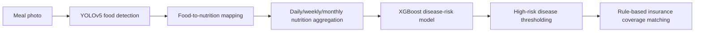

# EveryHI - Food Risk Insurance

Diet-image analysis PoC for estimating nutrition-linked disease risk and matching that risk to disease-insurance coverage.

EveryHI was built as a team insurtech competition project for users in their 20s who already track health habits but may not actively compare insurance products. The service concept turns meal photos into a lightweight health record: food detection, nutrition aggregation, disease-risk estimation, and explainable insurance-product filtering.

This repository is curated for portfolio review. It keeps the AI/data pipeline, notebooks, selected artifacts, and documentation that can be inspected publicly, while excluding raw datasets, private team materials, and Drive archives.

## Quick Review Path

1. Read this README for the service problem, role, evidence, and public-safety boundary.
2. Inspect [docs/project-brief.md](docs/project-brief.md) for contribution scope and reviewer notes.
3. Inspect [docs/modeling.md](docs/modeling.md) for the food-detection and disease-risk pipeline.
4. Inspect [docs/data.md](docs/data.md) for source data, excluded materials, and publication blockers.
5. Inspect [docs/recommendation.md](docs/recommendation.md) and [src/recommendation.py](src/recommendation.py) for the rule-based matching logic.
6. Review notebooks only as experiment records, not as a guaranteed end-to-end public reproduction path.

## Problem

Young adults often record meals and health habits, but insurance products are still difficult to compare against personal risk context. EveryHI explores whether a meal-photo habit can become a practical entry point for insurance discovery:

- Detect foods from meal images instead of requiring manual meal entry.
- Convert detected foods into daily, weekly, and monthly nutrition summaries.
- Estimate disease-risk signals from nutrition and demographic inputs.
- Recommend disease-insurance products that cover the predicted high-risk diseases.

The project is a proof of concept, not a production insurance, medical, or underwriting system.

## My Role and Contribution

This was a team competition project. My public contribution focus in this repository is the AI/data and portfolio-publication surface:

- Food-class definition, image collection workflow, YOLO label conversion, and detection-pipeline documentation.
- Disease-risk modeling notes using nutrition variables, age, sex, class-imbalance handling, and XGBoost selection.
- Rule-based insurance matching logic that keeps recommendation reasons explainable.
- Public-safe repository curation: README, data policy, modeling notes, notebook review path, and blocker documentation.

The README does not claim sole ownership of the entire team submission. Team-only planning files, raw data, and private submission materials are intentionally excluded from the public review path.

## Approach and Pipeline



### Core technical decisions

| Area | Decision | Why it mattered |
| --- | --- | --- |
| Food recognition | YOLOv5 object detection | Food photos can contain multiple items, so object detection fits the user flow better than single-label classification. |
| Food classes | Korean meal staples from the project dataset | The model was scoped to foods represented in the collected and labeled dataset, not arbitrary global cuisine. |
| Disease-risk model | Nutrition variables plus age/sex | The model links repeated diet records to disease-risk signals rather than single-image outputs. |
| Imbalance handling | SMOTE and stratified validation | Disease labels are imbalanced, so naive training would overfit the majority class. |
| Insurance recommendation | Rule-based filtering by covered diseases | The PoC favors explainable recommendation reasons over opaque ranking. |

## Evidence and Results

Evidence currently available in the public repo:

- Food image dataset design: 20 food categories in the presentation notes, roughly 300 images per food class, train:test split of 8:2.
- Food detection result: YOLOv5 training configuration documented as batch size 16 and 200 epochs, with reported mAP 0.94 at IoU 0.5 in the project artifact.
- Detection artifact: [artifacts/images/pr_curve.png](artifacts/images/pr_curve.png).
- Disease-risk feature design: 23 nutrition variables plus age and sex, documented in [docs/modeling.md](docs/modeling.md).
- Recommendation logic: inspectable example implementation in [src/recommendation.py](src/recommendation.py).
- Final presentation artifact: [artifacts/presentations/EveryHI_final_presentation.pptx](artifacts/presentations/EveryHI_final_presentation.pptx).

The repository does not invent new metrics beyond the preserved project artifacts. Full retraining evidence is limited because raw image, nutrition, and survey datasets are not included publicly.

## Repository Structure

```text
.
|-- artifacts/
|   |-- data/               # selected insurance-product artifact; review before public release
|   |-- images/             # representative result image
|   |-- models/             # trained model artifact; Git LFS / release-asset candidate
|   `-- presentations/      # final presentation artifact
|-- docs/
|   |-- archive-manifest.md # local archive policy
|   |-- data.md             # data sources, exclusions, and blockers
|   |-- modeling.md         # detection and disease-risk modeling notes
|   |-- project-brief.md    # portfolio brief and review path
|   |-- recommendation.md   # insurance matching logic
|   `-- retrospective.md    # limits and improvement path
|-- notebooks/
|   |-- 01_yolov5_food_detection.ipynb
|   |-- 02_yolo_label_conversion.ipynb
|   |-- 03_disease_prediction_model.ipynb
|   `-- 04_everyhi_insurance_recommendation.ipynb
`-- src/
    |-- detect_yolov5.py
    |-- extract_food.py
    |-- recommendation.py
    |-- translabel.py
    `-- yolov5_data.yaml
```

## Data and Public Safety

Public-safe materials are limited to curated docs, notebooks, source snippets, representative result artifacts, and the final deck already present in this repo.

Excluded from public publication:

- Raw food images, labels, crawled source data, and full contest/source datasets.
- Korean National Health and Nutrition Examination Survey raw data and original food-nutrition source tables.
- Team-private drafts, submission forms, personal information, signed documents, and Drive folders.
- Local `archive/` contents, copied `.git` folders, zip archives, credentials, and notebook checkpoints.

Known files requiring publication review before a new push or public release:

- `artifacts/models/yolov5_food_detection_best.pt` is 57,097,482 bytes, over the 50 MB portfolio threshold. Treat it as a Git LFS or external-release-asset candidate.
- `artifacts/data/disease_insurance_products.xls` is a risk-named insurance-product data file. It must be reviewed for redistribution rights and private/proprietary content before treating the repo as fully publish-ready.

## Reproducibility

This repo supports inspection-first review. The command `python -m src.recommendation` is currently unverified and blocked by malformed demo string literals in `src/recommendation.py`, so it is not advertised as a reproduction step.

```bash
pip install -r requirements.txt
```

What can be inspected publicly:

- Pipeline design in `docs/`.
- Notebook experiment order in `notebooks/`.
- YOLOv5 configuration and label utility code in `src/`.
- Recommendation ranking structure through source inspection of `src/recommendation.py`; the module-level demo is blocked until the demo literals are repaired.

What is not fully reproducible from a clean public checkout:

- End-to-end YOLOv5 retraining, because raw food images and labels are excluded.
- End-to-end disease-model retraining, because original survey and nutrition source data are excluded.
- Production-grade insurance matching, because official product terms, premiums, underwriting rules, and coverage details are not represented completely.

## Limitations

- The disease-risk model is a competition PoC and must not be used for diagnosis, underwriting, pricing, medical advice, or financial advice.
- The recommendation layer matches predicted high-risk diseases to covered-disease fields; it does not validate premiums, exclusions, waiting periods, eligibility, or current policy terms.
- Notebook code preserves experiment history and may require local paths or excluded data to rerun.
- The repository still contains two existing publication-review risks: a model file over 50 MB and an `.xls` insurance-product artifact.
- Service UX was conceptual; no production mobile or web application is included in this public repo.
