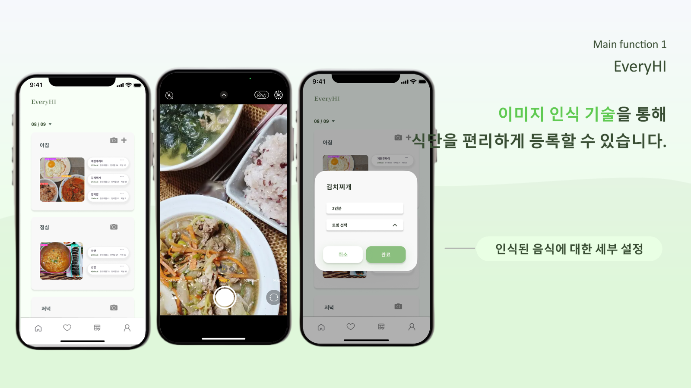
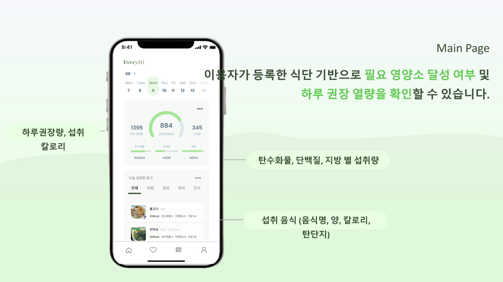
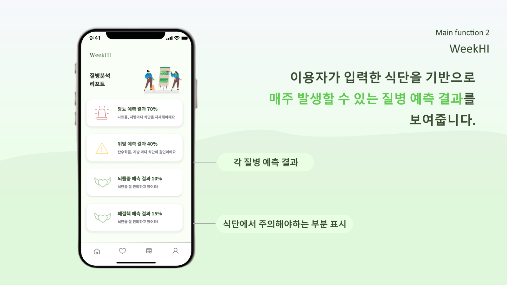
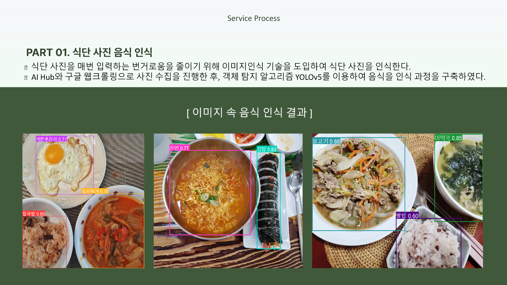
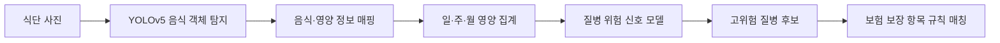
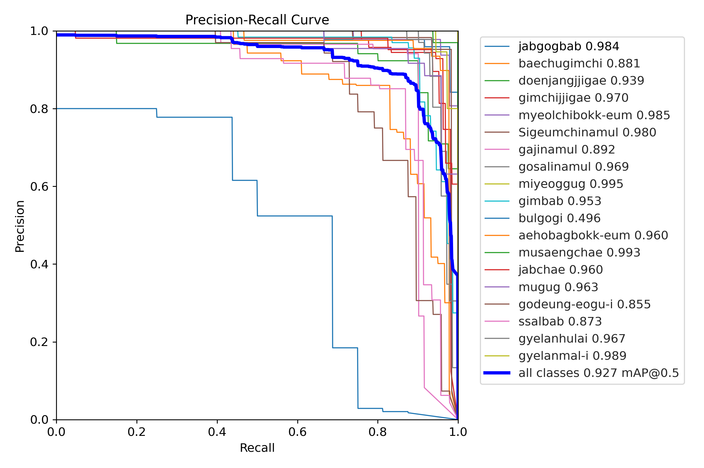

<p align="center">
  
</p>

<p align="center"><sub>실제 최종 발표 자료 14쪽의 식단 사진 등록·사용자 확인 흐름</sub></p>

# EveryHI

<p align="center">2023 삼성화재 리스크관리 공모전 · 식단 사진 기록을 건강관리와 보험 탐색의 맥락으로 연결한 인슈어테크 PoC</p>

<p align="center">
  <a href="artifacts/presentations/EveryHI_final_presentation.pptx">발표 자료</a>
  · <a href="docs/project-brief.md">프로젝트 브리프</a>
  · <a href="docs/modeling.md">모델링 근거</a>
  · <a href="docs/recommendation.md">추천 로직</a>
</p>

[](requirements.txt)
[](src/yolov5_data.yaml)
[](docs/modeling.md)
[](docs/data.md)

| 구분 | 내용 |
| --- | --- |
| 프로젝트 | 2023 삼성화재 리스크관리 공모전 팀 프로젝트 |
| 핵심 흐름 | 식단 사진 → 음식 탐지 → 영양 섭취 기록 → 질병 위험 신호 → 보장 항목 매칭 |
| 팀 | 문창수 · 박민규 · 유정은 · 이현지 |
| 공개 범위 | 원본 데이터·가중치·보험 원문을 제외한 AI/데이터 파이프라인 포트폴리오 |

> **PoC 범위**: 발표 화면의 위험도와 추천 값은 시연 예시입니다. 의료 진단, 보험 심사·인수, 보험료 산정 또는 금융 의사결정에 사용하지 않습니다.

## 빠른 검토 경로

| 먼저 볼 것 | 확인할 내용 |
| --- | --- |
| [최종 발표 자료](artifacts/presentations/EveryHI_final_presentation.pptx) | 문제 정의, 실제 서비스 화면, 음식 탐지·위험 신호·추천의 전체 흐름 |
| [프로젝트 브리프](docs/project-brief.md) | 프로젝트의 범위와 박민규의 기여 범위 |
| [모델링 근거](docs/modeling.md) | YOLOv5, 영양 변수, XGBoost·SMOTE·검증 설계 |
| [추천 로직](src/recommendation.py) | 개인·상품 원문 없이 확인하는 규칙 기반 보장 항목 매칭 |

## 왜 만들었나

건강관리에 관심은 있지만 보험에는 진입 장벽을 느끼는 20대에게, 매일의 식단 기록을 이해하기 쉬운 출발점으로 제시하고자 했습니다. EveryHI는 한 번의 상품 추천이 아니라, 사진으로 남긴 식단을 일·주·월 단위로 돌아보며 건강관리와 보장 항목을 함께 탐색할 수 있는지 검증한 프로젝트입니다.

## 서비스는 어떻게 작동하나

| 식단 기록 | 주간 위험 신호 | 음식 탐지 근거 |
| --- | --- | --- |
|  |  |  |
| 섭취 음식과 열량·탄수화물·단백질·지방 현황을 확인합니다. | 누적 식단을 바탕으로 주의가 필요한 위험 신호를 표시합니다. 화면의 비율은 시연 예시입니다. | 한 장의 식단 사진에서 여러 음식 객체를 탐지합니다. |

- **EveryHI**: 식단 사진을 기록하고 일일 영양 섭취 현황을 확인합니다.
- **WeekHI**: 누적 식단을 영양 변수로 집계해 질병 위험 신호를 조회합니다.
- **MonthHI**: 고위험 신호와 보험 상품의 보장 질병을 규칙으로 매칭해, 추천 이유를 함께 보여줍니다.

음식 **종류**를 탐지하는 구조이며, 사진만으로 섭취량을 자동 추정하지 않습니다. 시연 흐름에서는 탐지 후 사용자가 인분·토핑을 확인하거나 입력하는 단계를 전제로 했습니다.


```mermaid
flowchart LR
    A["식단 사진"] --> B["YOLOv5 음식 객체 탐지"]
    B --> C["음식·영양 정보 매핑"]
    C --> D["일·주·월 영양 집계"]
    D --> E["질병 위험 신호 모델"]
    E --> F["고위험 질병 후보"]
    F --> G["보험 보장 항목 규칙 매칭"]
```

## 구현과 판단

| 영역 | 구현 | 선택 이유 |
| --- | --- | --- |
| 음식 인식 | YOLOv5 객체 탐지 | 한 끼 사진에는 여러 음식이 함께 있어 단일 이미지 분류보다 객체 탐지가 맞았습니다. |
| 영양·위험 모델 | 23개 영양 변수 + 나이·성별, SMOTE, stratified validation, XGBoost | 표 형태 건강·영양 데이터를 다루고, 불균형 라벨을 고려하면서 모델 비교를 수행하기 위한 구성입니다. |
| 추천 | 고위험 질병 보장 여부와 위험 점수 합계로 정렬 | 추천 사유를 검토 가능한 규칙으로 남기기 위해 블랙박스 랭킹을 피했습니다. |
| 공개 설계 | 원본 데이터·모델 가중치·보험 원문 제외 | 민감 건강 데이터와 재배포 권한이 불명확한 자료를 포트폴리오에서 분리했습니다. |

## 결과와 검증 범위

| 항목 | 프로젝트 산출물에 남은 근거 |
| --- | --- |
| 음식 탐지 학습 | batch size 16, 200 epochs |
| 최종 발표 자료의 음식 탐지 평가 | IoU 0.5 기준 mAP **0.94** |
| 보존된 PR curve | all classes mAP@0.5 **0.927** |
| 데이터 설계 | 프로젝트 메모는 20개 음식 범주·범주당 약 300장, 공개 YAML은 22개 라벨을 보존 |
| 위험 모델 입력 | 23개 영양 변수, 나이, 성별 |
| 대표 산출물 | [PR curve](artifacts/images/pr_curve.png), [최종 발표 자료](artifacts/presentations/EveryHI_final_presentation.pptx) |

최종 발표 자료에는 IoU 0.5 기준 mAP **0.94**가, 저장소의 PR curve에는 all classes mAP@0.5 **0.927**이 남아 있습니다. 두 결과는 모두 원 프로젝트에서 보존된 서로 다른 산출물이며, 실행 로그와 원본 데이터가 공개되지 않아 동일 학습 실행의 결과라고 단정하지 않습니다. 이 저장소는 어느 수치도 공개용 재학습으로 다시 산출하거나 재현한다고 주장하지 않습니다.

<details>
<summary>보존된 모델 평가 이미지 보기</summary>

<p align="center"></p>
<p align="center"><sub>원 프로젝트에 남은 별도 학습 산출물의 PR curve이며, 범례의 all classes mAP@0.5는 0.927입니다. 공개용으로 다시 학습해 만든 결과가 아닙니다.</sub></p>

</details>

<details>
<summary>검토 시 참고할 데이터 범주 차이</summary>

프로젝트 메모에는 20개 음식 범주가, 공개 YAML에는 22개 라벨이 남아 있습니다. 원본 주석과 학습 설정이 비공개라 둘의 차이를 사후에 단정하지 않고, 원문 상태를 함께 보존합니다.

</details>

## 박민규의 기여

팀 전체 구현을 개인 작업으로 주장하지 않습니다. 이 공개 포트폴리오에서 설명 가능한 기여 범위는 다음과 같습니다.

- 음식 클래스 정의, 이미지 수집 흐름, YOLO 라벨 변환과 객체 탐지 파이프라인 정리
- 영양 변수 기반 위험 모델링 실험의 XGBoost·SMOTE·stratified validation 선택 근거 정리
- 보장 질병 기반 규칙 추천을 검토 가능한 코드로 정리
- 원본 데이터·팀 내부 자료·대용량 가중치를 제외한 공개 안전성 점검과 포트폴리오 문서화

발표 자료에는 팀원 이름만 남아 있어, 원문 근거 없이 다른 구성원의 세부 역할을 추정해 적지 않았습니다. 팀 전체의 결과를 개인 단독 성과로 주장하지 않는 기준도 함께 유지합니다.

## 저장소 구성

```text
.
├── artifacts/
│   ├── images/                 # 실제 발표 자료에서 추출한 서비스·모델 결과 이미지
│   └── presentations/          # 실제 최종 발표 자료
├── docs/                       # 문제 정의, 모델링, 추천, 데이터 공개 경계
├── notebooks/                  # 원본 데이터 없이 검토하는 실험 동반 노트북
├── src/                        # 라벨 변환, YOLOv5 실행 연결부, 추천 규칙
├── README.md
└── requirements.txt
```

| 경로 | 무엇을 확인할 수 있나 |
| --- | --- |
| [docs/data.md](docs/data.md) | 데이터 출처 범주와 공개/비공개 경계 |
| [docs/recommendation.md](docs/recommendation.md) | 질병별 임계값과 보장 항목 매칭 원리 |
| [notebooks/](notebooks) | 실행 결과를 비운 공개 검토용 실험 동반 노트북 |
| [src/recommendation.py](src/recommendation.py) | 개인·상품 원문 없이 확인하는 규칙 기반 추천 예제 |

## 실행 가능한 공개 예제

추천 규칙은 외부 데이터나 패키지 설치 없이 실행할 수 있습니다.

```bash
python -m src.recommendation
```

전체 재학습에는 공개하지 않은 원본 음식 이미지·라벨·영양/건강 데이터와 학습 가중치가 필요합니다. 공개 노트북은 입력 계약과 실험 판단을 검토하는 용도로 정리했습니다.

## 한계와 공개 안전성

- 위험 신호는 진단·치료·보험 인수 판단의 근거가 아닙니다.
- 추천은 보장 질병명 기준의 PoC 매칭으로, 보험료·면책/대기 기간·약관·가입 가능성·최신성을 반영하지 않습니다.
- 실제 원본 데이터와 학습 가중치는 제외했으며, README에는 최종 발표 자료에서 추출한 실제 화면만 사용했습니다.

공개 범위와 제외 사유는 [docs/data.md](docs/data.md), 사후 개선 계획은 [docs/retrospective.md](docs/retrospective.md)에서 확인할 수 있습니다.
